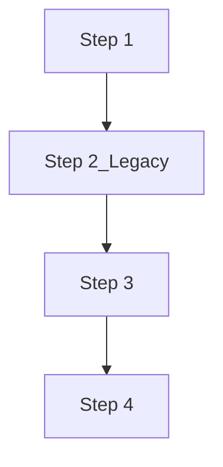
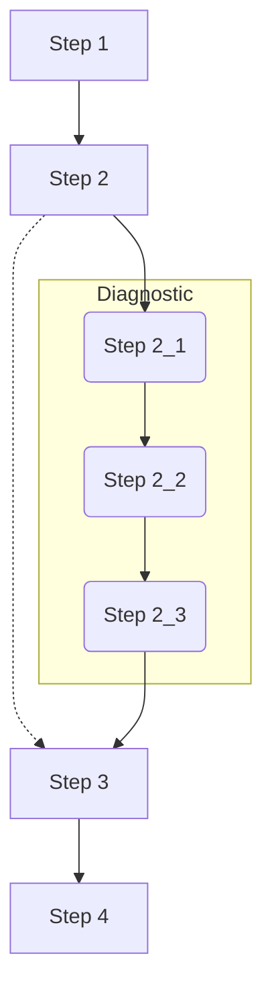
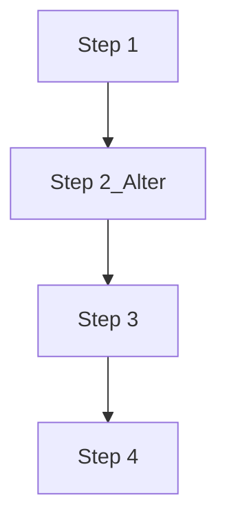

# Variant Calling Pipeline/Workflow

*Scripts in /original_scripts were created by Natalie Gonzales. We have changed various things across the years to optimize for our respective projects.*

For the most part, all three workflows are the same. The only difference is the preprocessing step. The Legacy workflow uses the original preprocessing script, while the Alternative workflow uses a modified version of the original preprocessing script. The Troubleshooting/diagnostic workflow uses the original preprocessing script, but adds additional steps to diagnose and fix issues.

The reason to "split" into these three workflows is to facilitate troubleshooting of failed .bam files. Some of the errors identified are lack of proper read group assignment, unpaired mates and missing mate information. The troubleshooting/diagnostic workflow adds steps to address these issues while the Alternative workflows aims to address the issues from the start. 

In all scenarios, you will need to replace the variables values in the *GLOBAL VARIABLES* and *VARIABLES FOR READ GROUP INFORMATION*
section of each script with your directory paths and file names.

For example, the global variables section: 
```bash
#### GLOBAL VARIABLES ###
WD="/lustre/project/svanbael/bolivar/Mimulus_sequences/mim3_bioinformatics/ddRAD/2_fastQC"
SEQID="bar_mim3" # Read group identifier/Project name and date for bam header
REF="/lustre/project/svanbael/bolivar/Mimulus_sequences/mim3_bioinformatics/MimulusGuttatus_reference/MguttatusTOL_551_v5.0.fa" # Path to reference genome
THREADS=20 # Number of threads to use
TMPDIR="/lustre/project/svanbael/TMPDIR" # Designated storage folders for temporary files (should be empty at end)
PICARD="/share/apps/picard/2.20.7/picard.jar" # Path to picard
OUTPUT_DIR="/lustre/project/svanbael/bolivar/Mimulus_sequences/mim3_bioinformatics/ddRAD/3_preprocessing/alignments_untrimmed/" # Path to directory where alignment files will be stored

```

The read group variable section:
```bash
### VARIABLES FOR READ GROUP INFORMATION ###
RGID= "bar_mim3" # Read group identifier/project name
RGLB="lib1" # Library name (could be anything)
RGPL="ILLUMINA" # Sequencing platform
RGPU="unit1" # Generic identifier for the platform unit

```

## Ferris Legacy workflow:


### The scripts for the Legacy workflow are:
```
variant_calling/
    ├── Step1_readQC.sh
    ├── Step2_Legacy_preprocessing_simple.sh
    ├── Step3_HaplotypeCaller_simple.sh
    ├── Step4_JointGenotyping_simple.sh
```

## Troubleshooting/diagnostic workflow:


### The scripts for the Troubleshooting/diagnostic workflow are:
```
variant_calling/
    ├── Step1_readQC.sh
    ├── Step2_1_diagnostics.sh
    ├── Step2_2_ReassigningRG.sh
    ├── Step2_3_FixMateInformation.sh
    ├── Step2_Legacy_preprocessing_simple.sh
    ├── Step3_HaplotypeCaller_simple.sh
    ├── Step4_JointGenotyping_simple.sh
```

## Alternative workflow:


### The scripts for the Alternative workflow are:
```
variant_calling/
    ├── Step1_readQC.sh
    ├── Step2_Alter_preprocessing.sh
    ├── Step3_HaplotypeCaller_simple.sh
    ├── Step4_JointGenotyping_simple.sh
```